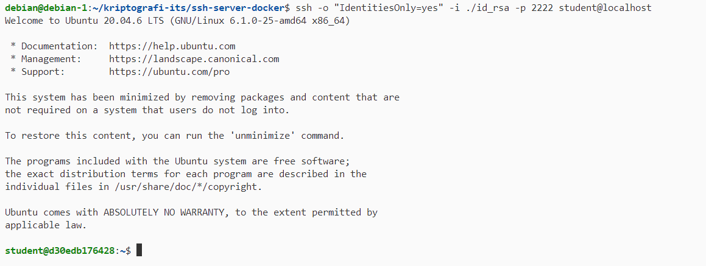

# 🔐 Belajar Mandiri: RSA & SSH Authentication 

**Disclaimer**: This is taken from [https://github.com/mocatfrio/cryptography-2025/blob/master/RSA-SSH.md](https://github.com/mocatfrio/cryptography-2025/blob/master/RSA-SSH.md). The goal of this repository is for self learning "workbook", and the summary is used as another proof of learning.

Belajar mandiri **kriptografi asimetris RSA (Rivest-Shamir-Adleman)**  dan implementasinya dalam **SSH (Secure Shell)** untuk autentikasi aman tanpa password.

## Summary

RSA (Rivest-Shamir-Adleman) is an asymmetric cryptography algorithm that can be used for SSH (Secure Shell) passwordless login. RSA works with public and private key, where each key has a number and `n`, the result of multiplication between two chosen prime number.

The number in private key is the inverse modulo of the number in public key, over modulo the result of euler's totient phi function between two chosen primary number.

The number in public key is chosen randomly between 1 and the result of euler's totient phi function between two chosen primary number.

Encryption or decryption is done by doing modular exponentiation to the received data raised to the power of number that is in private/public key, over modulo `n`. While the operation between encryption and decryption is similar, it's important to note that if encryption is done using public key, the decryption is done using private key, vice versa.

As a use case, RSA can be used for SSH login. This enables passwordless login, and the password is replaced with the user's private key. Initially, SSH server check if a client in login attempt has a RSA public key registered. If public key is registered, the server tries to decrypt a request from a cipher given by the client using the registered public key. In this case, cipher is done with private key. If cipher can be deciphered, server and client then continue communicate using the keys.

## Tujuan Pembelajaran

- Memahami dasar kriptografi RSA (public key & private key)
- Menjelaskan cara kerja autentikasi SSH dengan RSA
- Mempraktikkan penggunaan SSH key login tanpa password
- Membuat server virtual dengan Docker dan mengaktifkan SSH

## Tools

- Docker
- Python

---

## 🧠 Bagian 1: Pemahaman RSA (Non-Koding)

### Simulasi RSA Manual

Coba hitung dan pahami langkah-langkah berikut:

```
p = 11, q = 13
n = p * q = 143
φ(n) = (p - 1)(q - 1) = 120
Pilih e = 7 (relatif prima dengan 120)
Cari d = 103 (karena 7 * 103 mod 120 = 1)

Pesan: m = 9
Enkripsi: c = m^e mod n = 9^7 mod 143
Dekripsi: m = c^d mod n = ? (harus dapat 9)
```

Answer:

Using this script (from [this file](./multiplicative-inverse-workbook.py)):
```python
from math import floor
from math import sqrt

# Euclid's greatest common divisor algorithm: this is how we can verify
# whether (e,phi) are coprime ... with the gcd(e,phi)=1 condition
def gcd(a, b):

    while b != 0:
        a, b = b, a % b

    return a

# extended Euclid's algorithm to find modular inverse in O(log m) so in linear time
# this is how we can find the d value which is the modular inverse of e in the RSA cryptosystem
def modular_inverse(a, b):

    # of course because gcd(0,b)=b and a*x+b*y=b - so x=0 and y=1
    if a == 0:
        return b, 0, 1

    # so we use the Euclidean algorithm for gcd()
    # b%a is always the smaller number - and 'a' is the smaller integer always in this implementation
    div, x1, y1 = modular_inverse(b % a, a)

    # and we update the parameters for x, y accordingly
    x = y1 - (b // a) * x1
    y = x1

    # we use recursion so this is how we send the result to the previous stack frame
    return div, x, y

inv = modular_inverse(7, 120)[1]
if inv < 0: inv += 120
print(inv)
```

`d` is 103. Checking with found `d` value:
```
p = 11, q = 13
n = p * q = 143
φ(n) = (p - 1)(q - 1) = 120
Pilih e = 7 (relatif prima dengan 120)
Cari d = 103 (karena 7 * 103 mod 120 = 1)

Pesan: m = 9
Enkripsi: c = m^e mod n = 9^7 mod 143 = 48
Dekripsi: m = c^d mod n = 48^103 mod 143 = 9
```

Code snippet below is from: [Algoritma RSA](RSA.py)

```python
import random
from math import floor
from math import sqrt

RANDOM_START = 1e3
RANDOM_END = 1e5

def is_prime(num):
    if num < 2:
        return False
    if num == 2:
        return True
    if num % 2 == 0:
        return False
    for i in range(3, floor(sqrt(num))):
        if num % i == 0:
            return False
    return True

def gcd(a, b):
    while b != 0:
        a, b = b, a % b
    return a

def modular_inverse(a, b):
    if a == 0:
        return b, 0, 1
    div, x1, y1 = modular_inverse(b % a, a)
    x = y1 - (b // a) * x1
    y = x1
    return div, x, y

def generate_large_prime(start=RANDOM_START, end=RANDOM_END):
    num = random.randint(start, end)
    while not is_prime(num):
        num = random.randint(start, end)
    return num

def generate_rsa_keys():
    p = generate_large_prime()
    q = generate_large_prime()
    n = p * q
    phi = (p-1)*(q-1)
    e = random.randrange(1, phi)
    while gcd(e, phi) != 1:
        e = random.randrange(1, phi)

    d = modular_inverse(e, phi)[1]

    return (d, n), (e, n)

def encrypt(public_key, plain_text):
    e, n = public_key

    cipher_text = []

    for char in plain_text:
        a = ord(char)
        cipher_text.append(pow(a, e, n))

    return cipher_text

def decrypt(private_key, cipher_text):
    d, n = private_key
    plain_text = ''
    for num in cipher_text:
        a = pow(num, d, n)
        plain_text = plain_text + str(chr(a))
    return plain_text


if __name__ == '__main__':
    private_key, public_key = generate_rsa_keys()
    message = 'This is an example message with RSA algorithm!'
    print("Original message: %s" % message)
    cipher = encrypt(public_key, message)
    print("Cipher text: %s" % cipher)
    plain = decrypt(private_key, cipher)
    print("Decrypted text: %s" % plain)
```

---

## 🔐 Bagian 2: RSA & SSH – Apa Hubungannya?

### SSH menggunakan RSA untuk:

- Autentikasi: pengguna membuktikan identitas dengan **private key**
- Tanpa kirim password
- Server cocokkan dengan **public key** yang sudah disimpan

### Proses:

1. Client punya key pair RSA (`id_rsa`, `id_rsa.pub`)
   


2. Public key dikirim ke server (`authorized_keys`)
2. Saat login:
   - Server kirim permintaan → client tanda tangani pakai private key
   - Server verifikasi pakai public key
3. Jika cocok → client bisa login

---

## 🧪 Bagian 3: Hands-On SSH Server dengan Docker

### 1. Buat Folder Proyek

```bash
mkdir ssh-server-docker
cd ssh-server-docker
```

### 2. Buat `Dockerfile`

Given Dockerfile from the worksheet is:

```Dockerfile
FROM ubuntu:20.04

ENV DEBIAN_FRONTEND=noninteractive

RUN apt update && \
    apt install -y openssh-server sudo && \
    mkdir /var/run/sshd

RUN useradd -ms /bin/bash student && \
    echo "student:student" | chpasswd && \
    echo "student ALL=(ALL) NOPASSWD:ALL" >> /etc/sudoers

RUN mkdir /home/student/.ssh && \
    chmod 700 /home/student/.ssh && \
    chown student:student /home/student/.ssh

EXPOSE 22
CMD ["/usr/sbin/sshd", "-D"]
```

But upon running `docker exec ssh-demo service ssh restart` at step 8, the container will exit due to the `sshd` being restarted. The solution is to change the `CMD` at the end of the Dockerfile, attaching it to an infinite loop so that the container can be long lived and not tied to the `sshd` process:

```Dockerfile
FROM ubuntu:20.04

ENV DEBIAN_FRONTEND=noninteractive

RUN apt update && \
    apt install -y openssh-server sudo && \
    mkdir /var/run/sshd

RUN useradd -ms /bin/bash student && \
    echo "student:student" | chpasswd && \
    echo "student ALL=(ALL) NOPASSWD:ALL" >> /etc/sudoers

RUN mkdir /home/student/.ssh && \
    chmod 700 /home/student/.ssh && \
    chown student:student /home/student/.ssh

EXPOSE 22
CMD ["sh", "-c", "/usr/sbin/sshd -D & while true; do echo hi; sleep 1; done;"]
```

### 3. Build Docker Image

```bash
docker build -t ssh-server .
```


### 4. Jalankan Container

```bash
docker run -d --name ssh-demo -p 2222:22 ssh-server
```

---

## 🔑 Bagian 4: Setup RSA Key

### 5. Generate SSH Key Pair

```bash
ssh-keygen -t rsa -b 2048 -C "student@localhost"
```


### 6. Masukkan Public Key ke Server Docker

```bash
docker exec -i ssh-demo bash -c 'cat >> /home/student/.ssh/authorized_keys' < ~/.ssh/id_rsa.pub
docker exec ssh-demo chown student:student /home/student/.ssh/authorized_keys
docker exec ssh-demo chmod 600 /home/student/.ssh/authorized_keys
```


---

### ✅ 7. Uji Login SSH

```bash
ssh -p 2222 student@localhost
```

> Harus bisa login **tanpa password**



---

### 🔒 8. Nonaktifkan Password Login (Opsional)

```bash
docker exec ssh-demo sed -i 's/^#*PasswordAuthentication yes/PasswordAuthentication no/' /etc/ssh/sshd_config
docker exec ssh-demo service ssh restart
```


---

## 📄 Refleksi & Latihan

### 📝 Tugas Tambahan:

- Manfaatkan AI untuk memperbaiki error. Pahami kodenya, pahami errornya
- Ubah container agar hanya menerima RSA key (password disabled)
- Tambahkan user lain dan bandingkan proses login

> Tes `student0`


- Dokumentasikan seluruh proses (dengan screenshot)

### ❓ Pertanyaan:

1. Apa keuntungan RSA key dibanding password?

> Dalam konteks penggunaan RSA key untuk login melalui SSH secara passwordless, user tidak perlu untuk mengingat dan mengetik password setiap kali login. Disamping kepraktisan ini, karena kunci dalam RSA susah untuk ditebak dan memiliki range yang besar, kunci susah untuk ditebak melalui brute force dan semacamnya.

2. Mengapa private key harus dirahasiakan?

> Terminologi private key, dalam algoritma RSA dengan kriptografi asimetris, perlu dirahasiakan karena merupakan kunci yang hanya boleh dimiliki oleh pemilik kunci, sehingga seluruh data yang dienkripsi dengan public key memiliki kepastian hanya dapat dibuka oleh pemegang private key, dan seluruh data yang didekripsi melalui public key memiliki kepastian hanya dapat dibuat (dienkripsi) oleh pemegang private key.

3. Bagaimana kriptografi RSA bekerja dalam proses login SSH?

> Detail bagaimana kriptografi RSA bekerja dapat diamati di *log* miliki `sshd` dengan *log level* `DEBUG`. Setelah klien memulai koneksi SSH, server akan mengirimkan *challenge* ke client yang perlu didekripsi dan dikirim hasilnya kembali ke server. Jika *challenge* dekripsi OK, koneksi melalui SSH dapat dilanjutkan. Berikut adalah *log* yang didapat dari contoh login menggunakan key RSA:

```
May 07 05:28:00 ubuntu-server sshd[1155618]: debug1: Forked child 1158478.
May 07 05:28:00 ubuntu-server sshd[1158478]: debug1: Set /proc/self/oom_score_adj to 0
May 07 05:28:00 ubuntu-server sshd[1158478]: debug1: rexec start in 4 out 4 newsock 4 pipe 6 sock 7
May 07 05:28:00 ubuntu-server sshd[1158478]: debug1: inetd sockets after dupping: 4, 4
May 07 05:28:00 ubuntu-server sshd[1158478]: Connection from 192.168.0.165 port 57725 on 192.168.0.242 port 22 rdomain ""
May 07 05:28:00 ubuntu-server sshd[1158478]: debug1: Local version string SSH-2.0-OpenSSH_9.6p1 Ubuntu-3ubuntu13.11
May 07 05:28:00 ubuntu-server sshd[1158478]: debug1: Remote protocol version 2.0, remote software version OpenSSH_for_Windows_9.5
May 07 05:28:00 ubuntu-server sshd[1158478]: debug1: compat_banner: match: OpenSSH_for_Windows_9.5 pat OpenSSH* compat 0x04000000
May 07 05:28:00 ubuntu-server sshd[1158478]: debug1: permanently_set_uid: 109/65534 [preauth]
May 07 05:28:00 ubuntu-server sshd[1158478]: debug1: list_hostkey_types: rsa-sha2-512,rsa-sha2-256,ecdsa-sha2-nistp256,ssh-ed25519 [preauth]
May 07 05:28:00 ubuntu-server sshd[1158478]: debug1: SSH2_MSG_KEXINIT sent [preauth]
May 07 05:28:00 ubuntu-server sshd[1158478]: debug1: SSH2_MSG_KEXINIT received [preauth]
May 07 05:28:00 ubuntu-server sshd[1158478]: debug1: kex: algorithm: curve25519-sha256 [preauth]
May 07 05:28:00 ubuntu-server sshd[1158478]: debug1: kex: host key algorithm: ssh-ed25519 [preauth]
May 07 05:28:00 ubuntu-server sshd[1158478]: debug1: kex: client->server cipher: chacha20-poly1305@openssh.com MAC: <implicit> compression: none [preauth]
May 07 05:28:00 ubuntu-server sshd[1158478]: debug1: kex: server->client cipher: chacha20-poly1305@openssh.com MAC: <implicit> compression: none [preauth]
May 07 05:28:00 ubuntu-server sshd[1158478]: debug1: expecting SSH2_MSG_KEX_ECDH_INIT [preauth]
May 07 05:28:00 ubuntu-server sshd[1158478]: debug1: SSH2_MSG_KEX_ECDH_INIT received [preauth]
May 07 05:28:00 ubuntu-server sshd[1158478]: debug1: ssh_packet_send2_wrapped: resetting send seqnr 3 [preauth]
May 07 05:28:00 ubuntu-server sshd[1158478]: debug1: rekey out after 134217728 blocks [preauth]
May 07 05:28:00 ubuntu-server sshd[1158478]: debug1: SSH2_MSG_NEWKEYS sent [preauth]
May 07 05:28:00 ubuntu-server sshd[1158478]: debug1: Sending SSH2_MSG_EXT_INFO [preauth]
May 07 05:28:00 ubuntu-server sshd[1158478]: debug1: expecting SSH2_MSG_NEWKEYS [preauth]
May 07 05:28:01 ubuntu-server sshd[1158478]: debug1: ssh_packet_read_poll2: resetting read seqnr 3 [preauth]
May 07 05:28:01 ubuntu-server sshd[1158478]: debug1: SSH2_MSG_NEWKEYS received [preauth]
May 07 05:28:01 ubuntu-server sshd[1158478]: debug1: rekey in after 134217728 blocks [preauth]
May 07 05:28:01 ubuntu-server sshd[1158478]: debug1: KEX done [preauth]
May 07 05:28:01 ubuntu-server sshd[1158478]: debug1: userauth-request for user ubuntu service ssh-connection method none [preauth]
May 07 05:28:01 ubuntu-server sshd[1158478]: debug1: attempt 0 failures 0 [preauth]
May 07 05:28:01 ubuntu-server sshd[1158478]: debug1: PAM: initializing for "ubuntu"
May 07 05:28:01 ubuntu-server sshd[1158478]: debug1: PAM: setting PAM_RHOST to "192.168.0.165"
May 07 05:28:01 ubuntu-server sshd[1158478]: debug1: PAM: setting PAM_TTY to "ssh"
May 07 05:28:01 ubuntu-server sshd[1158478]: debug1: userauth-request for user ubuntu service ssh-connection method publickey [preauth]
May 07 05:28:01 ubuntu-server sshd[1158478]: debug1: attempt 1 failures 0 [preauth]
May 07 05:28:01 ubuntu-server sshd[1158478]: debug1: userauth_pubkey: publickey test pkalg rsa-sha2-512 pkblob RSA (redacted) [preauth]
May 07 05:28:01 ubuntu-server sshd[1158478]: debug1: temporarily_use_uid: 1000/1000 (e=0/0)
May 07 05:28:01 ubuntu-server sshd[1158478]: debug1: trying public key file /home/ubuntu/.ssh/authorized_keys
May 07 05:28:01 ubuntu-server sshd[1158478]: debug1: fd 5 clearing O_NONBLOCK
May 07 05:28:01 ubuntu-server sshd[1158478]: debug1: /home/ubuntu/.ssh/authorized_keys:1: matching key found: RSA (redacted)
May 07 05:28:01 ubuntu-server sshd[1158478]: debug1: /home/ubuntu/.ssh/authorized_keys:1: key options: agent-forwarding port-forwarding pty user-rc x11-forwarding
May 07 05:28:01 ubuntu-server sshd[1158478]: Accepted key RSA (redacted) found at /home/ubuntu/.ssh/authorized_keys:1
May 07 05:28:01 ubuntu-server sshd[1158478]: debug1: restore_uid: 0/0
May 07 05:28:01 ubuntu-server sshd[1158478]: Postponed publickey for ubuntu from 192.168.0.165 port 57725 ssh2 [preauth]
May 07 05:28:02 ubuntu-server sshd[1158478]: debug1: userauth-request for user ubuntu service ssh-connection method publickey-hostbound-v00@openssh.com [preauth]
May 07 05:28:02 ubuntu-server sshd[1158478]: debug1: attempt 2 failures 0 [preauth]
May 07 05:28:02 ubuntu-server sshd[1158478]: debug1: temporarily_use_uid: 1000/1000 (e=0/0)
May 07 05:28:02 ubuntu-server sshd[1158478]: debug1: trying public key file /home/ubuntu/.ssh/authorized_keys
May 07 05:28:02 ubuntu-server sshd[1158478]: debug1: fd 5 clearing O_NONBLOCK
May 07 05:28:02 ubuntu-server sshd[1158478]: debug1: /home/ubuntu/.ssh/authorized_keys:1: matching key found: RSA (redacted)
May 07 05:28:02 ubuntu-server sshd[1158478]: debug1: /home/ubuntu/.ssh/authorized_keys:1: key options: agent-forwarding port-forwarding pty user-rc x11-forwarding
May 07 05:28:02 ubuntu-server sshd[1158478]: Accepted key RSA (redacted) found at /home/ubuntu/.ssh/authorized_keys:1
May 07 05:28:02 ubuntu-server sshd[1158478]: debug1: restore_uid: 0/0
May 07 05:28:02 ubuntu-server sshd[1158478]: debug1: auth_activate_options: setting new authentication options
May 07 05:28:02 ubuntu-server sshd[1158478]: debug1: do_pam_account: called
May 07 05:28:02 ubuntu-server sshd[1158478]: Accepted publickey for ubuntu from 192.168.0.165 port 57725 ssh2: RSA (redacted)
May 07 05:28:02 ubuntu-server sshd[1158478]: debug1: monitor_child_preauth: user ubuntu authenticated by privileged process
May 07 05:28:02 ubuntu-server sshd[1158478]: debug1: auth_activate_options: setting new authentication options [preauth]
May 07 05:28:02 ubuntu-server sshd[1158478]: debug1: monitor_read_log: child log fd closed
May 07 05:28:02 ubuntu-server sshd[1158478]: debug1: PAM: establishing credentials
May 07 05:28:02 ubuntu-server sshd[1158478]: pam_unix(sshd:session): session opened for user ubuntu(uid=1000) by ubuntu(uid=0)
```
4. Apa risiko jika file `id_rsa` bocor?
> Resiko login dan operasi melalui SSH secara ilegal ke container yang telah dibuat.
